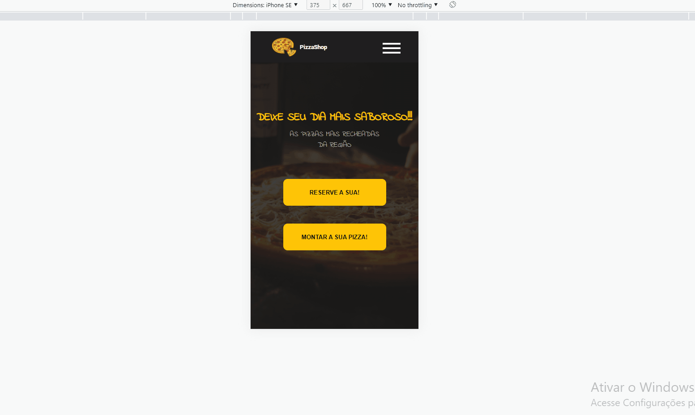

## Site Pizzaria - Responsivo
### Desenvolvido com HTML, CSS e JS.

    
    
    

### Este projeto é a criação de um site para uma Pizzaria ficticia.

 
    

### Para o desenvolvimento desse projeto foram desenvolvidas diversas habilidades com CSS, HTML e JS.

### Nele existem questões referentes a posicionamento de elementos, display grid, flex, hover entre outros.

### Cada sessão do site consta no menu superior e ao clicar em cada parte o úsuario é navegado para a sessão.

 
    

### Este projeto é responsivo, o javascript auxiliou para a criação de um menu hamburguer para telas menores.

 
    

### e o display grid para o possicionamento do cardápio

 
    

